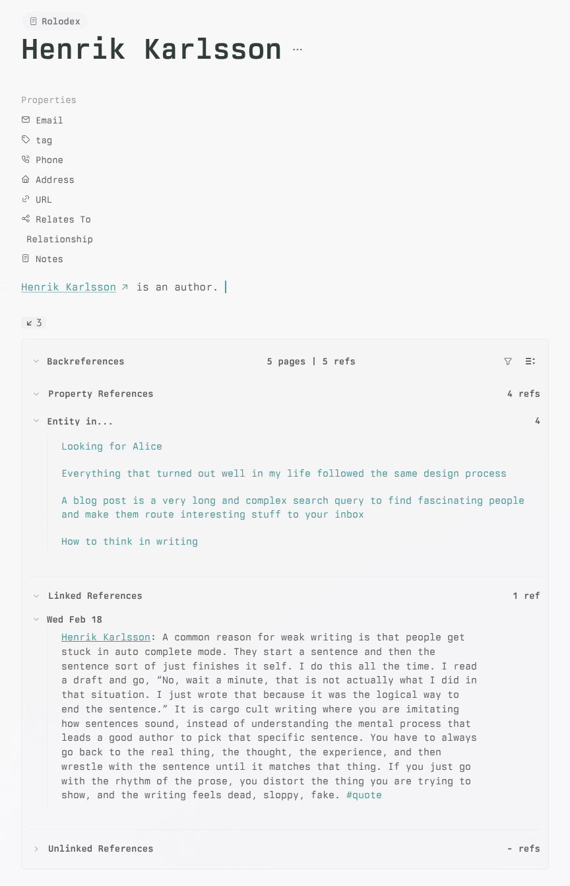

# Backreferences for Thymer

When you are writing a note, one of the first questions is: where else is this referenced?
Backreferences solves that problem by adding an always-available references panel to the active note, so you can quickly see incoming mentions and navigate to context.

Backreferences are useful for finding notes that reference the note you are writing. With Backreferences, you can see all references for the active note in one place, plus places where your note is referenced as a property value in other notes (grouped by property itself, shown as `Property in...`).

A backreference is a link from another note to the note you are currently viewing. This plugin shows both classic linked mentions and property-based references.

Built for [Thymer](https://thymer.com/) using the [Thymer Plugin SDK](https://github.com/thymerapp/thymer-plugin-sdk).

## Screenshot

## Credits

- Credit to [@ahpatel](https://github.com/ahpatel) and the fork [ahpatel/thymer-backreferences](https://github.com/ahpatel/thymer-backreferences) for the unlinked references and collapsible header work that informed this plugin.

## What It Shows

- **Property References**: references to the active note through record-link properties, grouped by property name.
- **Linked References**: line-level mentions grouped by source note.
- **Unlinked References**: text-only mentions of the active note title, grouped by source note, kept visually consistent with linked references, and loaded only after you expand that section.
- **Direct line navigation**: clicking a linked, unlinked, or expanded-context row asks Thymer to scroll to and highlight the exact source line, including when Ctrl/Cmd-click opens it in a new panel.
- **Live Activity**: new references added after a page opens are marked in place, and remote edits are called out inline.

## Options

- **Collapse results**
  - Use the header chevron to collapse or expand the Backreferences section.
  - Each subsection also has its own chevron toggle for hiding Property, Linked, or Unlinked references independently.
  - Pages remember footer + section collapse choices individually.
  - Without a saved page override, the full footer starts collapsed when there are no linked/property references yet, and `Property References` / `Linked References` start collapsed when they have zero matches.

- **Change sort order**
  - `Page Last Edited`: sort by most recently edited source note.
  - `Reference Activity`: sort by most recent matching reference activity.
  - `Reference Count`: sort by number of matching references per source note.
  - `Page Title`: sort alphabetically by source note title.
  - `Page Created Date`: sort by source note creation date.
  - Direction can be `Ascending` or `Descending`.

- **Use the filter button + query bar**
  - The header keeps `Filter` and `Sort` pinned in the top-right.
  - Clicking `Filter` reveals the query bar on its own row below the header.
  - The query bar borrows Thymer's native collection-filter styling and only shows the accent outline while focused.
  - The input placeholder now shows that you can either type plain text or a Thymer query.
  - Query autocomplete supports collections, built-in keys, users, and collection properties; long property lists stay scrollable in a native-style dropdown.
  - Plain text keeps the lightweight local filter behavior.
  - Query syntax like `@task`, `@Journey`, `"exact phrase"`, and `foo AND bar` uses Thymer's search language, but stays scoped to the current page's backreferences.
  - Record-level queries narrow Property References and Linked References together.
  - Unlinked References join the scoped query only when that section is expanded.
  - Plain-text matches still highlight inside rendered titles and lines.

- **Expand linked context**
  - Each linked mention starts with a compact `Show more context` control.
  - Clicking it expands the full child subtree for that mention and exposes up/down controls for nearby sibling lines.

- **Review unlinked mentions**
  - Text mentions of the current note title appear in a separate `Unlinked References` section.
  - That section starts collapsed and only runs its title-search query after you expand it.
  - The section reuses the existing search, sort, grouping, and context controls instead of adding a separate interaction model.
  - Source-note groups in both `Linked References` and `Unlinked References` can be collapsed per page.

- **Empty pages**
  - When a page has no linked/property references, expanding the footer shows the normal section empty states directly.

- **Live activity mode**
  - `New` marks references that appeared since the page was opened.
  - `Changed` marks references updated remotely after the footer had already loaded.

- **Toggle visibility**
  - Use `Backreferences: Toggle Globally` to show or hide the footer for all collections on this device.
  - Use `Backreferences: Toggle in Current Collection` to override the current collection on this device.
  - Visibility toggles only affect the local view; they do not save plugin configuration or sync across workspaces.

## Commands

- `Backreferences: Rebuild Graph Index`
- `Backreferences: Toggle Globally`
- `Backreferences: Toggle in Current Collection`

## Setup

1. In Thymer, open Command Palette (`Ctrl/Cmd+P`) and choose `Plugins`.
2. Create (or open) a **Global Plugin** entry.
3. Paste `plugin.json` into Configuration.
4. Paste `plugin.js` into Custom Code.
5. Save once after both tabs are updated.

Note: this plugin injects CSS at runtime; there is no separate `plugin.css` file.

## Configuration

Edit `custom` in `plugin.json`:

- `maxResults` (number): cap for search results.
- `queryFilterMaxResults` (number): cap for the global query run used to scope Thymer query filters back to the current page's references.
- `contextPreloadMaxLines` (number): cap for background line-context checks after a refresh. Set to `0` to disable context preloading.
- `showSelf` (boolean): include references originating from the active note.
- `defaultVisible` (boolean): install-time fallback for local visibility before this device has a saved visibility preference.

## Performance Diagnostics

Backreferences includes optional console timing for large workspaces. It is off by default.

To collect a report:

1. Open browser developer tools.
2. Run `BackreferencesPerf.enable()` in the console.
3. Reload Thymer.
4. Open notes that feel slow, expand/collapse Backreferences sections, try the filter bar, and expand Unlinked References if that workflow is slow.
5. Run `copy(BackreferencesPerf.report())` in the console.
6. Paste the copied JSON into the bug report.
7. Run `BackreferencesPerf.disable()` when finished.

The report contains refresh timings, search timings, context preload timings, property index timings, and reference counts. It does not include note text or raw search queries.

## Local Checks

- `node --check plugin.js`
- `node scripts/refactor-smoke.js`
- Or, with npm: `npm run check && npm test`

## Verification Checklist

1. Open a note that is referenced elsewhere.
2. Confirm Backreferences appears at the bottom.
3. Confirm the top summary stays compact while each section header shows its own ref count.
4. Open a note with no linked/property refs and confirm the full footer starts collapsed by default.
5. Expand that empty footer and confirm Property References and Linked References render their empty messages directly.
6. Expand `Unlinked References` on an empty page and confirm it loads normally before showing its empty message when applicable.
7. Open notes with zero property refs or zero linked refs and confirm those empty sections start collapsed by default when the rest of the footer has content.
8. Change the footer or section collapse state for one note, navigate away, return, and confirm that page-specific choice persists.
9. Confirm Property References are grouped by property with an outside-chevron collapse toggle when applicable.
10. Confirm property records and linked rows sit visibly nested under their parent property/source headers.
11. Confirm Linked References are grouped by source note.
12. Confirm Unlinked References appear separately when the note title is mentioned without a record link.
13. Confirm linked rows hover/focus as a single row while the context controls remain independently clickable.
14. Confirm only the Filter and Sort buttons appear in the header's top-right before the filter bar is opened.
15. Click `Filter` and verify the query bar appears on its own row below the header.
16. Confirm the query bar copy makes it clear that plain text and Thymer query syntax are both supported.
17. Focus the query bar and verify the accent outline appears only while focused.
18. Type `@Sources`, accept the collection autocomplete, and verify the query remains `@Sources` rather than `@@Sources`.
19. Type `@Sources.` and verify all properties are available in a scrollable autocomplete list.
20. Type plain text and verify the footer filters/highlights matching titles and lines.
21. Type query syntax such as `@task`, `@Journey`, and `foo AND bar` and verify only matching backreferences remain.
22. Expand `Unlinked References`, repeat a query, and verify that section joins the scoped results.
23. Change sort field and direction and verify order updates.
24. Collapse and re-expand a linked group and an unlinked group and verify the per-page toggle only hides that group's rows.
25. Expand a linked or unlinked reference and verify descendants load first, then above/below context can be added with the arrow controls.
26. Make or receive a new reference while the page stays open and verify `New` / `Changed` badges update.
27. Click a source note to navigate; Ctrl/Cmd-click to open in a new panel.
28. Click a linked, unlinked, or context line row and verify Thymer scrolls to and highlights the exact source line.
29. Ctrl/Cmd-click a linked, unlinked, or context line row and verify the new panel opens with the exact source line highlighted.
30. Run `Backreferences: Toggle in Current Collection` and confirm the footer disappears only in the active collection.
31. Run `Backreferences: Toggle in Current Collection` again and confirm the footer returns without reloading the plugin.
32. Run `Backreferences: Toggle Globally` and confirm the footer hides everywhere, then run it again and confirm collection overrides are cleared.
